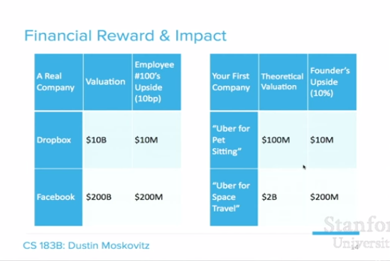
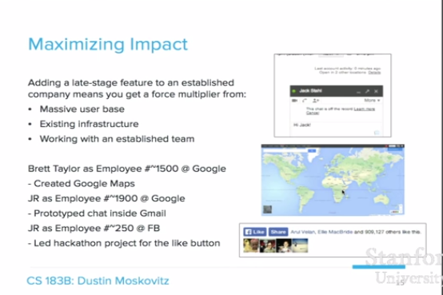

# Dustin Moskovitz - Good and Bad Reasons to Become an Entrepreneur  

* 作者：Dustin Moskovitz
* 原翻譯連結：http://startupclass.club/topics/124

我在斯坦福GS 183B課程上演講中發表了關於該題目的理解，如果你希望獲得更多關於如何成為一名企業家的討論，歡迎收看該視頻。我也會在本文中穿插相應的幻燈片來幫助大家理解。

最近，我在Asana 主持了一個由Ben Horowitz，Matt Cohler 和Justin Rosenstein和我參與的答疑會。來自Wired雜誌的Marcus Wohlsen 參加了此次會議並撰寫了關於矽谷企業家精神文化的文章。因為這話題很重要，所以我希望花些時間，也在這篇博客中說說我的觀點。但是，我要說明下，我們談話的內容僅限於矽谷的文化，而不是一般的「小型商業企業家」。所以，對於今天的觀眾而言，企業家專指「矽谷創業初期的技術型公司企業家」。

在這個前提下，我們說你“大部分可能”不應該是個企業家，但不是說你絕對不是。這是一個明確的方向性定義，但是我們相信對於那些在矽谷的生態系統中的許許多多的創業者和企業家來說，這與有著很大的區別。許多人認為這些意味著更多。我們正在持續抵消這種觀點。無論你何時抵消一種偏激觀點，你都漸漸脫離偏激，當然這些在我的視頻有所體現（在我上一篇發表的關於相關觀點總結的視頻中）。

當你對一個想法抱有極大的熱情，並覺得將它帶到這個世界的最好方式就是為此成立公司的話，那麼這是你立志成為一名企業家最給力的理由。激情之所以重要源於企業家精神的辛苦與不易，你不僅要充滿韌性不斷努力奮鬥，還要說服其他人施與援手。實現它的最好的辦法就是建立一個新公司這種想法對於持續鞏固以上的特質（包括最重要的你的時間）是非常重要的，而且你將會很好的發揮這些特質。如果這些靈感是由一個已經存在的團隊帶到這個顯示的世界，那麼這對於這個世界的優化是重複且冗餘的。當然，在現實中並非每一個人都在不斷嘗試優化效果。但是很多企業家由於他們的認同，他們會不斷修正，並且通過這種角度看問題對於這些人極為重要。

如果你不是在最大化這種效果，那麼以下結論看起來是一個合理的假設，就是你可以替換掉那些不斷提高自身生活水平的事情。你可以希望完全自由的選擇如何去生活，而不去考慮它是否能給其他人帶來更多的價值甚至於對於其他人都是已經存在且多餘的東西。亦或者你可以極度靈活的安排自己的時間表，可以在極短的時間裡決定一段時間停止工作。也有可能你希望研究某中特定的問題和特定的人。很多案例表明，你可能實際上希望找到一個公司，可以讓他們把自己交給你，但是自己一個人開一個公司，我認為這是一條可行的捷徑。我喜歡那些給世界帶來巨大的影響力的人們。但是這並非唯一的出路，且我沒理由去否定這種企業家。

有了上面的解釋，現在我們來看看那些想成為企業家卻不那麼站得住腳的理由：

你希望自己掌管一個大公司。印象筆記CEO Phil Libin在去年如是說：
人們夢想者有一家自己開創的公司，自己成為那個金字塔的頂點，自己做CEO。有些人甚至以此為動力，但是事實並非如此。

其實，真實生活中，人人都有自己的老闆，無論是你的僱員，客戶，合夥人，用戶，媒體或是你的上司。今天的我已經不可能再有更多的老闆了，或者向更多的人去解釋。

大多數CEO的日常生活就是向其他所有人匯報，至少我和我認識的絕大部分CEO都是如此。如果你想擁有凌駕所有人的權力，軍隊和政壇是個好選擇，但是，企業家？你還是別想了。
你認為這是一份富有魅力的職業。媒體成功的將各式的企業家打造成被崇拜的對象，加冕成王，或者描繪成多樣的組織首領，但其實這些都是過度渲染了。那些年復一年的辛苦工作，甚至在對的方向都還一籌莫展的情況才是真實的常態。

你相信你擁有非凡的才能並且這種才能可以幫助你最大化你的財務狀況。你為什麼不多一些選擇呢？這其實是一個邏輯上的瑕疵，因為Facebook的第100位工程師所創造的價值要遠遠高於99%的矽谷企業家。巨大餡餅的一角依舊是巨大的。如果你確有才能，你可以很輕鬆的識別出一家擁有高的成長潛力以及相對低風險的公司並從中得到回報。如果你幾年後發現是錯的，你依舊可以在嘗試一次。在2到3次嘗試後，你更有可能獲得很好的結果並有自信確認在為了長久的價值而努力。但是，如果你取而代之的迅速開始了一個“下一個Google或者Facebook”的項目，那麼你將極有可能有一敗塗地，或者面臨解決極小產出的壓力。你要知道你試不了幾次，因為每一次嘗試都會花費很長時間才能看到結果，無論成功還是失敗。

加入一個已經成立好的公司還是建立一個自己的公司？財務結果哪一個更好？顯而易見，後面的例子預示了你的成功。

舉例：加入一個成立好的公司並取得巨大的成績

你聽過Paul Graham將非聯合創始人比作動物園裡的動物，而且不想看起來像個笨蛋（或者大猩猩）。Jeff Atwood指出，這比現實更能映射出一些東西。這些像是從Dilbert卡通畫中脫離出來的公司對待員工十分苛責，但是你懂得，他們是大公司。為了這些公司中的一個工作或者為了自己工作。但是一定不能為了那些“強姦靈魂”的地方去工作。

誠然，這些觀點有些主觀。我們希望在Asana和最優秀的人在一起工作，而最優秀的人往往選擇了創業成為企業家而不是接受像我們這樣的公司。這就意味這我們只需要找到一小部分這樣的人就可以和我們一起取得成功。這更關係到在一種巨大的效應，那些將他們的才智浪費掉地的效應，那些人們浪費時間在沒有價值事情的效應。由於以上的原因，Zuck自己也已經明顯的意識到今天的矽谷已非想Facebook這樣的公司創立的地方了。關於微觀效應，我想引用Justin的話作為總結“如果你奉獻了你最好的年華去工作，全身充滿了愛，那麼你周圍的世界由於你的工作會使你更加厚重。”

