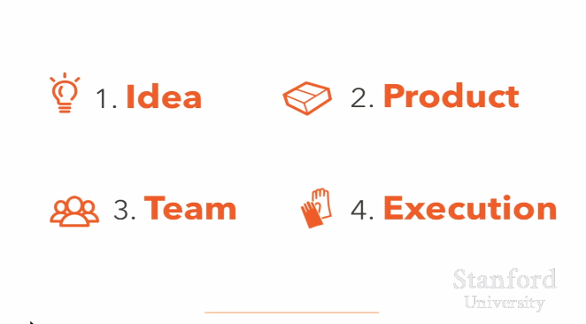

# 創業點子、產品、團隊和執行（第一部分）& 我們為什麼要創業

作者：Sam Aleman
譯者：張路遙，吳雲泥，黃沁，Teresa
原翻譯連結：http://startupclass.club/topics/39

歡迎來到CS183B。我是Sam Altman，我是Y Combinator的總裁。九年前，我還是斯坦福的一名學生，接著我輟學去創辦了一家公司，後來我成為了一名投資人。所以在YC，我們已經指導人創業九年了。儘管其中大部分都是針對特定項目的，但仍然有30%是通用的。雖然這只是創業路上的30%，但仍然希望它能給你們帶來幫助。

這堂課的內容我們在YC已經教過很多次，但從來沒有被錄下來過。這是第一次我們教的很多東西將被錄下來。我們邀請了一些我們的演講嘉賓來做和他們在YC做的相同的分享。YC已經投資了725家公司，所以我們確信這里大部分建議是相當好的。我們沒法投資所有創業公司，當我們有希望讓所有人都能接觸到這些建議。

我只教三課。算上YC自己，每一個演講嘉賓都曾經參與創辦過一家十億美金以上的公司。所以這些建議不會那麼理論化，都是已經被實踐過的。

這門課所給出的建議，是面向那些正在創建一門生意的人，他們的目標是高速成長並最終發展成一家大公司。這裡許多建議並不能應用到其他場景中，所以我要提前警告大家，如果你打算把這些東西用到大公司或者非創業公司中去，它不會管用的。這是很有意思的，我確實認為創業就是未來，值得我們花工夫去理解它們，但創業公司和普通的公司又有很大的不一樣。所以今天和周四的課上，我將要對創業關鍵的四個方面給出一個概述，來幫助​​你最大限度地取得創業成功。然後在整個課程中，演講嘉賓們將會對這些方面進行更詳細深入的闡述。

這四個方面就是：你需要一個偉大的創業點子，一個很棒的產品，一個傑出的團隊，和完美的執行。儘管這些有部分是重疊的，但我不得不分開講來把它們說清楚。

你可能仍然會失敗。創業最終結果有點像：點子x 產品x 執行x 團隊x 運氣。

其中運氣是一個零到一萬的隨機數。

真的是這樣。但如果你在這四個方面做得非常好，你有一個不錯的機會至少獲得一定程度的成功。

有一個令人興奮的事情就是，創業就像玩一樣。當你年輕又缺乏經驗時，你能做這事兒。當你年老又經驗豐富時，你也能做這事兒。創業中我特別喜歡的一點就是，有些事情在其他工作場景下很糟糕，例如又窮又無知，但在創業的時候卻是一筆巨大的財富。

在我們討論怎麼創業之前，我想先談談為什麼要創業。對於開這門課我本來是有點猶豫的，因為我不希望你們為了創業而創業。有很多更簡單的方式可以讓你變得富有，每一個創業者都總說，他們完全沒有想到創業是那麼艱難那麼苦逼。只有在你被一個問題困住，並且覺得創辦一家公司是解決它的最好辦法的時候，你才應該去創業。

必須現有明確的激情，然後才有創業。事實上，我們在YC的所有課都以此為前提。所以今天課程的後一半，我會交給Dustin Moskovitz，他會談談為什麼要創業。這門課受到這麼多的關注讓我們都震驚了，所以我們要確保花了足夠多的時間討論為什麼要創業。

四個方面中的第一個：一個偉大的創業點子。最近幾年很流行說，點子不重要。實際上，花大把時間思考創業點子一點都不酷。你應該立刻開始，丟掉所有包袱，看是什麼拖累了你，你甚至不用花時間想做這些有沒有價值。

pivots挺好的，如果多來幾次那更好了。所以這也不是完全錯誤的，事情會以我們完全預想不到的方式演化。所以當你還沒有把產品送到用戶手上前，你的了解是非常有限的。所以好的執行至少比好的點子重要十倍、難上一百倍。

但是這個事情已經有點脫離正軌了。糟糕的點子依舊是糟糕的，並且在這個現如今樂於創業的世界中，我們還依然感覺良好。基於糟糕的點子，即使有非常好的執行，你也無法擁有好的結果。當然，有很多例外，但是大多數偉大的公司是從一個偉大的點子開始的。

如果你看那些成功的案例, 它們通常都是從創始人自身的需求衍生的，而不是一個隨機產生的想法。Airbnb的源起，是因為創始人Brian Chesky付不起他的房租，而且他還有空餘房間。如果你回過頭看看這些成功案例的過去的發展，通常來講他們沒可能變為大公司。我個人呢，過去會認為點子其實不重要，但是我現在非常確信這是錯誤的。

點子的定義，像我們討論的，是非常廣泛的。它包括市場的規模和發展空間，公司的發展策略、保護策略等。當我們評估一個點子的時候，需要考慮所有這些方面，而不僅僅是產品本身。實現一個想法，你需要計劃將未來十年的時間花費在這上面，這樣你才有足夠多的時間全面思考產品和公司的價值。即使計劃本身是沒有意義的，計劃的執行卻會非常有價值。這一點在當今的大多數創業公司中都缺失了。

長期思考雖然在其他領域非常少見，但是在創業公司中卻存在著。進行長期思考具有非常多的好處。請記住，隨著你的思考，你的點子也會變的更加寬泛且向各個領域延伸。你當然不用將你未來執行過程中的每一步都搞清楚，但你確實需要從一個核心點開始。並且，你需要以一些有意思的方式展開。

當我們查看各種點子的時候，有一點經常被創始人們忽略，那就是你需要建立一個別人難以復制的產品或業務。而這對於一個好點子來說非常重要。

我想要重申這個觀點，因為這非常重要：先有點子，再有創業。當你擁有一個感覺必須要去探索的點子之後，再創業吧。這也可以用於選擇好的點子。如果你有幾個點子，選擇那個你不在工作時在你腦海中出現最多的點子吧。我們從創業者聽到的最​​多見的就是，他們希望他們當初並不那麼著急創業，而是去等待他們最深愛的那個點子出現。

另外一種思考就是，大多數偉大的公司都有使命感。除非大公司有使命感，否則很難把握大公司業務需要的關注點的數量。而且，沒有一個根本的偉大的點子也通常會很難。有使命感的好處就是你自己會全身心的投入。建立一個偉大的創業公司需要花費很多年，通常十年以上。如果你不熱愛或者不相信你所建立的事業，你很可能在這過程中放棄。我覺得如果沒有那種“目標必須實現”的信仰，你不可能度過創業過程中的痛苦與艱辛。很多創業者，尤其是學生，他們認為創業只需要花費2到3年，然後他們就可以繼續做他們真正熱愛的事情。這樣是無法成功的。好的創業，通常要花費十年。

使命感的第三個好處是公司外部的人員會更願意幫助你。相比複製其他項目而言，開始一個重要的且充滿挑戰的項目，你會得到更多的幫助。所以對於創業而言，開啟一個充滿挑戰的創業項目，比開始一個簡單的創業項目，反而會更容易。這屬於與正常認知相反的情況，是需要很長時間理解的。很難講擁有使命感到底有多重要，所以我想要最後一次強調：基本沒有全新觀點與視野的公司，就是那些複製其他已有點子的公司，不會使人們興奮，也就不會使團隊成員足夠努力工作，從而難以獲得成功。

Paul Graham下週會來講講如何獲取創業點子。這是很多創業者糾結的地方，但我相信你會在實踐中更好的掌握這點，而且這真的非常值得嘗試。

獲取偉大的點子中最難的部分，就是最好​​的點子在最開始會顯得非常糟糕。第十三代搜索引擎，且沒有任何網站門戶功能？大多數人會覺得這個沒有意義。搜索已經被做得差不多了，而且沒有那麼重要吧，門戶才是價值所在。第十個社交網絡，而且只提供給那幫沒有消費能力的大學生？也是個糟糕的點子。MySpace已經成功了，誰想要大學生變成用戶？反正怎麼想都很糟糕。

這些點子聽上去很糟糕，但是最後卻很成功。如果它們起初聽起來很酷，有可能就會有很多人都開始嘗試做。正如Peter Thiel 將要在第五節課上討論的那樣，你會希望你的點子獲得壟斷地位。但是你不可能直接獲取壟斷。你必須找到一個小的市場來獲得壟斷然後迅速擴張。這就是為什麼偉大的創業點子一開始看起來會很糟糕。如果你能這樣說那就很好了：“今天，只有一小部分人會使用我的產品，但是我會獲取這部分全部的用戶。未來，幾乎所有人都會使用我的產品。”

今後會經常提到的一個主題就是：你需要信仰、信念，並且願意忽略其他所有人的反對意見。困難的部分在於，這會是一條非常狹窄的堅持之路。一邊是正確，另一邊是瘋狂。但是你需要記住的是，如果你有一個偉大的點子，大部分人會覺得這是糟糕的。你應該為此感到高興，這說明他們不會來和你競爭。

這就是為什麼，告訴其他人你的想法並不危險。真正好的想法聽上去並不會那麼值得抄襲。你需要的是一個你能這樣描述的點子：“我知道這聽上去像一個壞點子，但它實際上它是一個偉大的點子，具體原因如下……” 你得聽上去很瘋狂，但是實際上又得是正確的。你得要一個其他很多人都不會去做的點子。而且，即使這個點子最初聽起來不是個大生意，也沒關係。

創業者中的一個普遍錯誤，尤其在初創者中，就是他們認為產品的第一個版本，也就是他們點子的第一個版本，需要聽上去可以覆蓋很大的市場。但其實不是。它只需要覆蓋一小部分市場，並且從那裡開始擴展。這是大多數偉大公司開始的方式。不流行但是正確，是你努力的方向。你需要一個聽上去很糟糕的，但實際上又非常好的點子。

你也需要花時間去思考，市場如何進化。你需要一個十年內會發展很大的市場。現在大部分投資者會很在意市場規模，但他們並不思考市場以後會如何進化。

事實上，我認為這是投資者犯的最大的系統級錯誤之一。他們會思考創業公司本身的發展，卻不思考市場的發展。我更在意市場的發展速度，而不是當前的規模。而且我還會在意這個市場會不會因​​為某種可能達到最大。你應該思考一下這點。我更喜歡投資的的公司，他們所專注的，是當前規模小但發展速度非常快的市場，而不是一個現在很大，發展卻很緩慢的市場。

這些規模較小但發展快速的市場有一個極大的優勢，那就是目標用戶們通常極度渴望一個解決方案，因此，他們會選擇一個不那麼完美，但是快速成長的產品。作為學生的一個巨大的優勢在於，你比年齡更大的那些人對哪些市場將要開始快速發展有更好的直覺，這也是學生的兩個最大的優勢之一。另一件事，通常情況下學生自己並不理解，或者需要花上一段時間才能理解的，那就是你不可能創造一個完全不存在的市場。在一家創業公司，你基本上可以改變任何事，但是唯獨市場是無法改變的，所以你最好先仔細想想來確定你要進入的市場是真實存在且是會發展增長的，至少你要盡可能地確定這件事。

在形容一個對的市場的時候有很多種方式，比如，趕上其他人的浪潮，步入了一部上升的電梯，或者說成為一次變革中的一員，但這些都只是你想進入一個即將非常快速發展的市場的不同說法。這個市場今天看起來很小，也許現在它的確只是個小市場，但是你知道——而其他人都不知道——這個市場即將極為快速地發展起來。

所以，請仔細思考下，這件事正發生在世界上的哪個地方。你需要藉著這股順風的力來幫你把一個創業公司做成。

令人興奮的事情是，當下這種順風力可能要比以往任何時候都多。就像Mac Andreessen說的那樣，軟件正在吞噬世界。各個領域都充斥著太多偉大的點子了。你只需要從中挑一個，並且找到那個你真正特別關心的。

這個問題的另一個版本考慮的是相同的觀點，也就是紅杉資本的著名問題：為什麼是現在？為什麼現在是實現這個特別的點子的完美時間點，為什麼要在現在來建立這樣一個特別的公司，為什麼兩年前不做，而且為什麼未來兩年又會太遲？所有我們接觸到的最為成功的創業公司，都有著非常毓秀（偉大）的點子，並且對這個問題有個完美的答案。如果你不是這樣的，那你至少應該多多少少對這個問題心存下疑慮。

大多數情況下，創造些你自己需要的東西那是最好不過的了。這樣你對產品的理解，要比你通過和一個目標用戶聊天的方式來建立最初的版本強很多。如果你在開發的東西是自己不需要而是別人需要的，那你需要明白，你自己正處於一個巨大的弱勢中，務必保證自己和你的用戶要走的非常非常近。如果可以的話，嘗試著在他們的辦公室里工作，如果不行，那也要保證一天之中會和他們多次交談。

另一件有過一個好點子的多少違反直覺的事情是，這些好點子基本上都是非常容易解釋清楚並且非常容易去理解的。如果一句話不能解釋清楚你在做的事情，那麼這通常情況下是一個信號，你的點子太過複雜了。你的點子應該能夠通過少數幾個詞來非常清楚明晰有條理的表達出來。一般情況下最好的點子會與現有公司大不相同，這種不同或者體現在某項非常重要的業務流程上，比如，Google作為搜索引擎要完爆其他的那些門戶網站，又或者就是你的點子是全新的，比如SpaceX。任何一家公司，如果去克隆一些已經存在的東西，不管是做出一些小的業務變化或者在外觀上做一些差異化——比如做出更漂亮的設計，或者專門服務一些喜歡紅酒的人，他們通常情況下都會以失敗告終。

所以如我所說，做一個學生最好的事之一就是你對新技術總是有著極好的觀點。學會找到一個好點子需要花費一段時間，所以，你最好現在就立刻開始在這方面努力。我們總是能聽到人談起的就是，他們總希望他們還是學生的時候能多做一些事。

另一件極為不錯的事情就是你可以發現一些潛在的聯合創始人。你們已經意識不到你們現在處於的環境是有多麼的好，你隨處可以見一些你能和他一起開啟一家公司的人。而有一件我們會經常和學校學生們說的事就是認識一些潛在的聯合創始人遠比任何一家獨特的創業公司要重要。

所以我今天想用一段來自50 Cent（注：美國說唱歌手）的話來結束我這部分的演講。這段話來源於他被問及Vitamin Water廣告的時候。我不會讀它，它就在那，但重要的是你要想清楚消費者要的是什麼，並且想清楚市場的需求是什麼。大多數人不做這個，尤其是大多數學生。如果你能把這一件事做了，如果你能緊緊學著實現考慮市場，你會領先其他開始創業的人一大步。不實現思考市場，不提前去思考人們想要的是什麼，這大概也就是我們大多數情況下不看好一些YC應用的原因。

在下一節中，我將會討論如何建立一個好的產品。在這裡我要再一次用下一個較為寬泛的產品的定義。一個產品包括用戶支持，你寫下的產品解釋，以及你的用戶群與你為他們開發的東西之間產生的一切交互。

要建立一家偉大的公司，首先你必須將一個好點子變成一個好產品。這很難，但卻至關重要，好在這個過程充滿樂趣。雖然很棒的產品對世界而言都是推陳出新的，要給你在做什麼東西方面給個建議也很難，但是新產品之間有著大量的共性，我們可以就如何創造新產品給你諸多建議。

作為一位創始人，最首要的任務之一就是確保公司能推出一個偉大的產品。直到你推出一項很棒的產品前，別的什麼都不重要。每位真正意義上成功的創始人在講述他們創業早年時光時，幾乎都是坐在電腦前研究自己的產品或者和客戶們進行交流。幾乎所有的時間都在幹這些。他們很少做別的事情，如果你的時間安排與此大不相同的話，那你應該仔細考慮下自己的時間安排了。當你有了一個好的產品之後，創始人們努力去解決的其它諸多問題，諸如融資、宣傳、招聘、業務拓展等等都會變得容易很多。所以，推出一樣很好的產品才是你需要最先關注的。第一步就是創造一樣用戶們熱愛的東西。在YC，我們讓創業者們做的事情就是研究自己的產品、和用戶交流、運動、吃飯和睡覺，別無其它。所有其它我剛剛提到的事情----諸如公關、會議、招聘顧問、尋求合作夥伴等，你都應該忽略掉。你所需要做的就是做成一樣產品並通過和你的用戶溝通，讓你的產品盡可能變得更好。

你的工作就是創造一些用戶熱愛的東西。幾乎沒有一家公司可以在沒有首先把產品做好的情況下還獲得卓越成功的。很多只善於紙上談兵的創始人的失敗原因就在於他們僅僅做出了人們喜歡的產品。做出人們想要的東西，但僅僅只能到達讓人喜歡的程度，這很大可能會導致失敗，而這些創始人甚至都不明白自己為什麼失敗。所以說，喜歡和熱愛是完全不同的兩回事。

我們在YC中經常說到一個觀點，就是最好​​推出的是一小部分人熱愛，大多數人之後會喜歡的產品。當然，如果能做出這種讓大量用戶熱愛的產品是最好的了，但是實際上對於v1來說這種機遇是很少的，而且這些機會通常創業公司難以把握。所以現實中，你最終會折中處理這個問題。你們會推出一些大多數用戶有點喜歡的東西，或者少數用戶極度熱愛的東西。這點建議很重要。推出一些少數人酷愛的東西。將一個少數人酷愛的產品推廣到很多人喜歡，然後從大眾喜歡再到很多人酷愛，會容易很多。如果你做對了，那麼在其它很多事情上發生錯誤（也沒有大問題）。如果你這點沒有做對，那麼即使你把其他所有的事情都做對了，你仍有可能失敗。所以當你開始創業的時候，這就是你唯一需要做的事情，你必須堅持到底，直至見到成效。

【觀眾】：你能再放一遍那個幻燈片麼？

所以在創業時你是有選擇機會的。所有領域裡最棒的事情就是推出一樣很多人真正熱愛的產品。而事實上，你一般實現不了這一點。因為一旦有這樣的機會，Google或者Facebook就會去做。所以，就好像這條曲線下方的區域面積，也就是我們可以創造的東西，是有限的。所以，你可以選擇創造大量用戶還算喜歡的產品或者少數用戶極度酷愛的產品。所以就想愛的總量是一定的，就看你怎麼分配了。【觀眾笑聲】這就是這次交談的原則，通過你的創業中的首個產品，你能給這個世界帶來多少歡樂。

所以創業者經常糾結於應該選擇哪個目標。這兩種目標實現的結果看起來是一樣的，對吧？因為他們在這條曲線下方實現的面積是一樣的。但是我們再來看一遍這個，他們其實是不一樣的。如果你創造了某些人喜愛的東西，那麼要推廣這些東西則非常容易。你可以將這些東西推廣成為其他很多人都喜愛的東西。但是如果你剛開始就抱著矛盾模糊的態度，或者投入的熱情不夠，還試圖將產品推廣。那麼你的產品永遠都不會得到很多人的喜愛。所以，我們的建議是：定位一小群使用者，並讓他們愛上你的產品。

能讓你意識到這種做法起作用的事，就是你的產品就會通過人與人的口耳相傳而為人所知。如果大家喜愛你的產品，他們就會告訴自己的朋友。這對消費類產品和企業產品同樣有效。當大家真的喜愛某樣東西的時候，他們就會跟自己的朋友介紹這樣東西，那時候你就會看到產品的有機增長了。

如果你發現自己認定會有強大的合作夥伴救你於水火或者有類似的解決麻煩的後路，故而認為產品銷量沒有增長也無妨的話-,這大抵是有真正麻煩的跡象。銷售和市場固然重要，我們稍後會有兩堂課程來說。然而一樣很棒的產品是卻是保證長期增長的秘訣所在。你首先必須掌握這項秘訣。將推出一樣很棒的產品這一工作推遲的做法並不會讓一切變得更加容易。如果你試圖在擁有一樣能讓一些人真正喜愛的產品前創建一個實現銷售增長的機制。毫無疑問，你是在浪費時間。實現真正突破的公司幾乎都有一個非常出色的產品，然後產品的知名度會通過口耳相傳而增長。長時間後，很好的產品就會勝出。別去管你的競爭對手籌集了多少資金或者接下來要做什麼。很可能他們根本就不是很好。很少有創業者是在競爭中被打敗的。很多創業者失敗是因為他們沒有創造出用戶喜愛的產品，他們把時間浪費在了其它事情上。所以，你應該擔心的是這些。

要創造用戶喜愛的產品的另一條建議是：從一些簡單的東西入手。如果你能創造出簡單的東西，那麼要推出一樣偉大的產品便會非常非常容易。即使你最終計劃的產品超級複雜（我們也希望是這樣）。你幾乎都是從解決你認為最不起眼問題的小設備開始的。要創造一樣出色的產品很困難，因此你應該從盡可能小的表面區域開始。想想那些真正成功的公司，他們剛起步的時候在幹什麼，然後想想那些你真心喜愛的產品。這些產品整體使用起來都極為簡易，尤其是剛開始使用的時候。第一版本的Facebook簡單得三歲小孩都會用。Google的第一版本也僅僅是一個只有一個文本框和兩個按鈕的頁面；但是谷歌總能給你最好的搜索結果，這就是為什麼使用者喜歡它的原因。Iphone用起來也要比其它比它更早推出的智能手機更為簡單，所以它也成為了用戶真正喜歡的第一部智能機。

商品簡單可以帶來好處的另一個原因是因為這可以迫使你把一件事做的極度好。你必須得這樣做才能做出人們喜愛的產品。

在你們聽成功創始人在講述他們對自己產品的想法時，你們能經常聽到“狂熱”這個詞。創始人們會談及他們對於關注產品小細節的質量方面的嫉妒狂熱。他們狂熱的方面有：對說明自己產品如何定位正確的狂熱，以及表達自己對客戶支持態度的狂熱。事實上，一個與YC公司成功相關的因素之一是這些公司的創始人將頁面任務連接到他們票務系統中，這樣一來，即使用戶在半夜創始人睡著的時候發郵件，他們仍然可以在一個小時內收到回复。公司實際上在開始階段會這樣做。在產品不好的時候，公司的創始人會感覺渾身不自在，經常會半夜修復產品。他們不會推出垃圾產品，但如果推出了垃圾產品，他們也會很快將它修好。因此，要造出出色的產品，創始人對產品的痴迷也是有相當水平要求的。

你需要一些用戶來幫助你完成反饋循環。但是你只能人工來找到這些用戶---你應該親自徵募這些使用者。早期招募首批用戶時，不要通過諸如購買Google廣告之類這樣的方式。你不需要很多使用者，你只需要一些能每天給你反饋信息並最終會喜愛你的產品的使用者。因此，不要通過Google廣告詞來尋找這些人。全世界範圍內，你只需要那麼幾個能勝任的使用者。所以，親自去尋找這些用戶。

當所有人都認為Pinterest只是個笑話的時候，Ben Silbermann通過在咖啡店聊天的方式招募了他的第一批用戶。他的確是這麼做的。他當時就在Palo Alto轉悠，然後跟別人說“請問你要不要試試我的產品？”他也跑遍了Palo Aloto的蘋果店，並試圖在店員發現他並把他趕出去之前盡快將所有的瀏覽器主頁變成Pinterest。（笑聲），這樣一來，當人們進來的時候，他們就會問“哎呀，這是什麼呀？”這是一個關於細節決定成敗的典型例子。如果你還沒有看過Paul Graham寫的一篇關於該話題的論文，你絕對有必要看一下。

所以，親自找一些用戶，記住，你的目標是要讓這一小群人喜歡你。要對這一小群人了解透徹，要和他們保持很密切的關係。聽取他們的意見，你會發現幾乎大多數情況下他們都願意給你提供反饋意見。就算你是在為你自己創造商品，也去聽聽外部用戶的意見，他們會告訴你怎樣讓你的商品變得讓人們樂意去花錢買。盡一切努力讓他們喜歡你，讓他們知道你在幹什麼。因為他們也可能會幫助你推廣你的產品，幫你找到下一批用戶。

如果你想在公司內部設立一種機制來將用戶的反饋轉化為產品決策。那麼就按照用戶的方式回復反饋信息。問問他們喜歡哪些地方，不喜歡哪些地方，並看看他們如何使用你的產品。問問他們覺得哪些地方花錢會比較值當。問問他們如果你的公司離開了，他們會不會真的覺得失望。問問他們哪些地方值得他們把產品介紹給他們的朋友。以及他們是否已經向朋友推薦了該款產品。

你應該盡可能保證這一反饋環節的緊密性。如果你的產品每週優化10%，這樣的增加是很快的。軟件創業的一個優勢就是你可以將反饋環路制定得很短。可以以小時計算，最好的公司往往擁有最緊湊的反饋環路。你應該盡量讓這一反饋環路在你公司的整個生命週期中都存在。然而，這在早期階段尤為重要。

好在以上這些都是可行的。雖然這很難，也需要很多努力，但是這並不是什麼不可思議的事情。至少計劃的目的很明確，最終你將會創造出一件很出色的產品。

出色的創始人是不會讓其他人介入他和用戶之間的。這些公司的創始人在早期階段連銷售和客服工作都是親力親為的。將這一環節植入到企業文化中十分關鍵。事實上，我們經常看到的斯坦福創業中存在具體問題是，基於某些原因，學生試圖直接僱傭人員來完成銷售和客服工作，你必須要自己來幹這些事情，這是唯一正確的做法。

你真的需要通過定量來讓自己保持坦誠。公司也的確會按照CEO決定的任何標準來進行考核。如果你建立了一項網絡服務，就不要在乎總註冊量之類這樣的東西-不要談論它，也不要讓公司裡的任何人談論-你需要做的是關注增長和活躍用戶、活躍水平、留存率，收益和淨推介值。這些指數才能說明問題。如果這些指數都沒有按照理想的趨勢發展，那麼你要絕對坦誠。創業靠的是增長，只有增長才能說明一樣商品是否出色。

所以，這就是的如何創造偉大產品的的所有內容。我想再強調一遍，如果你沒有做到這些，我們所講的其它東西都沒什麼意義。在這點起作用之前，你可以忽略課堂上講的所有其它內容。積極點來講，這可是創業過程中最有趣的部分。

所以在這裡我將暫停一下。我們將在周二講述剩下的部分。現在Dustin將講一下為什麼創業。歡迎Dustin。

為什麼創業
耶……Sam讓我講講為什麼創業。我經常聽到的人們關於創業的普遍理由數不勝數。知道你自己創業的原因很重要，因為別人的原因在某些環境下是合理的，有些實際上則會將你引上歧途。你可能已經被好萊塢或者媒體上的被浪漫化創業意圖所誤導，所以我將試著對以下可能的謬論進行說明，這樣你們就會更清醒地做決定。首先我想說的是我最喜歡真正創業的理由，這個理由與Sam剛剛講的很多內容相關。但是呢，我認為這並不是一個最普遍的理由。通常人們創業的理由都是這些其它理由中的一個，或者，你知道，他們只是為了開公司而開公司。

所以列舉起來，有四個理由是比較吸引人的。那就是：你們將會成為老闆；你們在各方面，尤其是在時間安排上將會更靈活；你們將有機會發揮更大的影響力，賺更多的錢之後你們可能會加入一家後期公司。

你們可能對這一概念會比較熟悉，當我寫Medium Post的時候，你們當中很多人一年前就讀過，我感覺在新聞界發生的這一故事多多少少有點失真。創業變得有些太過浪漫主義化。電影《社群網站》上映後，對於如何成為一名企業家這一觀念產生了很多不好的影響。但是，電影主要刻畫的場面像是，有很多場聚會，你周轉其中，​​對所有的事物都具有敏銳的洞察力，讓人覺得這樣做真的很酷。

但我的認為是，現實很殘酷。作為一名企業家，首先有醜陋的一面，然而更為重要的是，你們實際上會花大把的時間來做很多辛苦的工作。Sam剛剛也提到了這一點，你所做的基本上就是坐在桌前，集中註意力、埋頭回复客服郵件、搞銷售並解決困難的工程問題。因此，你睜大眼睛投入工作至關重要，當然這也會讓你很有壓力。最近在新聞界的熱門話題是：經濟學人上一周刊登了一篇名為“匿名企業家”的故事。這個故事講述了一位創始人喜歡躲在自己的桌子底下，訴說創業者的壓抑。所以，這是很真實的。大家都實際些，如果你要開一家公司，那將是非常非常艱苦的。

為什麼會如此有壓力呢？有兩個原因。首先是你將擔負很多責任。從事任何的職業都害怕失敗，但這只是一種普遍的心理狀態。但是當你成為一名企業家時，你對失敗的恐懼不僅代表了你自己的恐懼，還代表了所有決定跟隨你的人的恐懼。所以，這讓你很有壓力。有時候人們將自己的生計寄希望於你，即使不是這樣，他們也決定將自己最好的年華貢獻出來跟隨你。所以，你要對他們的時間的時機成本負責。大家可能隨時需要你，如果出現狀況-----可能不會經常出現在凌晨三點，對於某些創業者來說的確是這樣----但是如果發生什麼重要的事情，你都要去解決。這大概就是這個故事的結局。不管你是在度假，還是在過週末，你要時刻留心，思想上要時刻準備著去處理一些諸如此類的事情。這種壓力的特例就是融資。

《社交網絡》中有這樣一個場景：大家都在聚會，同時也在工作。有的人把香檳噴的到處都是-《社交網絡》關於這樣的場景很多。Mark沒有出現在場景中，電影花了大量時間在想方設法將mark描繪成一個十足的混蛋

這是一個發生在Palo Alto的真實場景，他更多的時間是在這張桌子旁邊，低著頭，注意力集中。Mark有時候仍是一個壞蛋，但是他的這種壞更讓人覺得有趣、萌萌噠，並不是一種反社會的、一個被鄙視的情人的那種壞。所以，這就是他意在集中精神，專注工作，不參與社交的寫照。

然後，還有一幕展現了這一頓悟的時刻，有點像《美麗心靈》中，他們完全引用了那個場景。因此他們想描繪這一場景，並從這些時刻跳到另外一些時刻，中間都是在參加聚會。但事實上，我們一直都是坐在桌旁。所以，如果你比較這張圖片，Mark的姿勢從未變過，圖片唯一的區別是，他每天都穿了不同的衣服。這就是我本人的實際感受。我就是這樣的，這就是剛剛我談論的經濟學人刊載的那篇文章。

因此對創業者來說不受歡迎的媒體關注對他們來說是另一種壓力。一般來說，只有得到媒體關注正面曝光時，才能讓他們出名。很榮幸，我今年成為了《時代》的封面人物。但如果上《人物》封面的是你的婚紗照，那麼也許就不太不適了。其實這取決於你是誰,我真的很討厭這樣,但是當Valleywag八卦你的講座和讓你淚奔時，你不想要這樣,你絕對不希望這樣。沒人想要。

我幾乎從未聽人談論他們自己是多麼的負責。所以如果你在初創公司不開心,壓力大，事情進展不順，你可以離開。作為創始人來講,你也可以離開,但這是極不冷靜的做法,在你以後的事業發展中也會使你前程黑暗。如果順利，你一定要挺住10年，如果不順利也要盡量挺住5年。三年,是你判斷公司運營不好的時間點，如果之後你為公司找到了好歸宿，那麼剩下的兩年就要收購這家公司。在強調一遍，如果在這之前離開，你傷害的不止是公司的財政,而是你公司的所有員工。如果你幸運的話,你有一個糟糕的創業點子,你會迅速失敗,大多數情況劇情並非如此發展。

因此，在我的生命力曾承受過很多類似的壓力，特別是在Facebook剛剛創建時，那是我身體很糟糕，最沒精力的時候。在過去的的日子裡，實際上，幾乎每六個月，我都會處於很焦慮的狀態，二十一二歲是，最為嚴重。所以如果你確定要創建公司了，就一定要意識到你會面臨這些，你一定要解決好身體的問題，這是你的責任心的核心。Ben Horowitz習慣說CEO的首要任務是照顧好身體，這話說得非常對，一定要這樣做。

另一個原因,特別是如果你在另一個公司還有工作,你開始這樣想,比如說：運行這個公司裡面的人都是傻子,他們事無鉅細都要去討論決定，而且把時間都花在了這些愚蠢的討論和決定上,我要開一個公司一定能做得更好。我會設立所有的規章制度去優化。

聽起來不錯,很有道理。如果你讀過我在媒體發表的文章,你就會知道會發生什麼,現在給你們一秒鐘讀這句話:

那些有願望想自己創建公司當CEO，站在金字塔尖的人，有些人是被地位驅使的，但並非所有人都是。事實是：除了你的所有人都是老闆，你的所有員工，顧客，夥伴，客戶，媒體都是你的老闆，以前從來沒有像現在一樣這麼多人需要我去考慮。大多數CEO的生活都對外曝光了，至少我和我熟知的CEO是這樣的。如果你想對別人使用權利，那還是去參軍或參政，別當老闆。-Phil Libin

這使我產生了共鳴，我想指出的是這些決定的事情很微妙。可能你認為是白痴的人並不白痴,只是在他們面前面臨了非常困難的決定,人們的想法各不相同。所以作為CEO最尋常的事就是我不得不花費時間精力去解決其他人帶給我的問題，而通常這些問題都是衝突的。人們想做不同選擇，顧客想要不同的東西。也許在這方面我有自己的看法，但我的工作就是讓那些最讓我失望的人和難題都解決掉。

甚至在每天最基本的事情上，我都可以把如何完善公司的宏偉計劃拿到週一去解決。但是如果是我的重要的員工辭職了，那就是我最重要的事了，我需要花時間處理它。

作為老闆的一點好處就是你有絕對的自由，你可以自己制定自己的日程，這確實是個吸引人的想法。但事實是下面這樣的。

Phil Libin 
如果你要成為老闆，老實說你確實時間會比較靈活，一天24小時，你想什麼時候工作都可以。-- Phil Libin

這點上也讓我很贊同。但我再強調一下，之所以這樣的原因是，你要隨叫隨到，也許你並不想每天的全部時間都工作，但這並不是你能控制的了的。

你是公司的典範，這點非常重要。你可能身體有時好有時壞，有時你會身體特別差想休息幾週，但很不幸，你是老闆。你的團隊只能感受到你在辦公桌上帶給他們的信號，如果你前腿走了，他們也會這麼做。

無論如何，你都得工作。如果你的工作是由興趣驅使的，興趣就會拉動你工作，如果你是和牛逼的投資人、和一些牛逼的團隊工作，他們會非常努力的干活，他們同樣希望你努力工作。

許多公司喜歡講這樣的故事，你可以有好處並享受它，也許你可以一周只工作四天，如果你是Tim Ferris，你還可以一周只工作12小時，多麼吸引人的想法呀！但這只是特例，特例是說你研究完市場後只想運營一家小公司，當小公司的老闆。但根本沒意義，因為只要捏員工數達到兩三人，你還是要建立全職的體系。

你會很有錢並且更有影響力

這是我聽到的特別是像申請公司的候選人說到的最可能的一個。他們說：他們確實很想在小公司工作或自己創建小公司，但當我有更大份額或公司更有影響力時，我就會有更多的股份，那樣就會賺更多的錢，所以如果真是這樣，咱們就一起去研究下。

現在我解釋一下這個表格，看起來有點複雜但咱們現在左側的表。這些都是解釋Dropbox 和Facebook的，這些都是他們當前的估值,然後第二欄代表第100個加入的員工你能賺多少錢，特別如果你是有經驗的或者說是相對有經驗的工程師，譬如說是有五年工作經驗，應該會拿到大約10基點左右的工作。如果是幾年前來的Dropbox，你的薪資大概鎖定在1000萬美元，並且還會有很多上升空間。如果是幾年前來的Facebook，你的年薪估計已經達到2億美元了，這是個大數，就算你是第1000位員工，差不多2009年進入，你也還是拿到了2000萬美元，那是個大數，當你思考你可能會作為一個企業家時你就會考慮這些方面。

再看右邊的表,這是你可能遇到的兩種理論。“寵物坐的Uber”,很不錯的主意,如果你真的能做成這個，你可能會有一個很好的機會建立一個1億美元的公司，你的公司的股份額可能會在10%左右,這方面幅度會很大，有的創始人多些有的創始人少些，但多次股權稀釋,多次建立期權池後你很可能最終就拿到那些股份。如果你擁有比這些超出太多，我推薦你研究山姆的創始人和員工之間的關於股權分配的郵件，你應該給員工更多的激勵。

所以，基本上來講，如果你對賺1個億十分有信心了，這其實是個很大膽的問題。毫無疑問，2009年的Facebook和2014年的Dropbox能讓你也更有信心，即便你的創業公司還不存在，這也值得一試，如果你有賺1個億的想法，你還有信心能做到，我會考慮投資。

如果你認為自己非常適合做“宇宙航行行業的Uber”，這是個偉大的想法，是一個值20億美元的想法，而你也確實會得到相當豐厚的回報，你顯然應該去做這件事。但這是四年後才會看到的價值，這種想法就像有腿一樣，也會隨之變化。如果你想做這件事，可能你都不應該現在在這上課，直接去創建公司吧。

為什麼這件事情在經濟上有回報，同時富有影響力呢？我真的覺得經濟上的回報和我們對世界的影響力緊密相連，如果你不認同，我會給你舉一些專門的例子，暫時先不考慮股權。

為什麼會後期加入一個公司有更多的影響力呢？這得力於一個增益的機制:他們有的大量的用戶基礎,如果是Facebook就有十億用戶,如果是谷歌就有十億用戶,他們還有你要創建的基礎設施,儘管初創公司AWS和一些小的牛逼的獨立服務器可以滿足你的需求,加入大公司你會經常得到一些已經打包好的輔助性技術,這是一個很好的起點。而當你開始和團隊合作了,它將把想法變成更偉大的事情。

舉幾個具體例子，Bret Taylor在谷歌1500人時加入的，他開發了谷歌地圖，這是你們幾乎每天都用的產品，我用地圖來到這，而其他人在全世界的各個角落用地圖。他無需創建公司做這件事，他只需一筆巨額資金支持，但這個想法至今極具影響力。

不久我的協同創始人賈斯汀Rosenstein在Brett之後也加入了谷歌，他是那的產品經理，就因為一個次級的項目，他關停了一個聊天功能，這是個獨立的APP，現在他把它整合在GMAIL裡，就像你在右上角看到的那樣，在他弄之前，你可能不能想像你能在Ajax或者在瀏覽器裡聊天。而他做了demo，給團隊展示並實現了。這個產品也是你們幾乎每天都用的產品。

也許更令人印象深刻的是,賈斯汀離開後不久,他成為Facebook大概第250位員工，他和安德魯·博斯沃思這些人創建hackaton項目創造了“Like”這個按鈕,如今這是網絡上最流行的元素之一,完全提升了人們的使用體驗,然後這又是不需要創立單獨公司去做的項目，如果做了也肯定會失敗，因為它的成功是依託於Facebook 的基礎。

所以重要的是要記住，你想要創立公司的目的是什麼，你用什麼方式能把它實現。

那麼最好的理由到底是什麼？

Sam已經對這個話題討論了一些，但是基本來講你有幾件事是不得不做的，你對這個好點子極度有熱情，你是做這事適合的人，你會讓它運轉，那麼到底是哪出現了問題？

這是個文字遊戲，有兩件事作為創始人你是必須堅持的，一件是你必須富有激情，無論如何你都會去完成這件事，這很重要，因為熱情會使你在創業早期度過很多難關，你還需要辦事有效率的員工，他們能夠在你幹不動的時候感覺到，周​​圍還有很多充滿激情的創業團隊，員工們也可以離開你去為他們工作。這個是企業家的基礎之一，如果你潛意識的狀態能時刻被大家察覺，告訴大家你沒有激情，那麼問題就大了。

另一種理解方式是，世界需要你這麼做。想法很重要，這點無可厚非。它能讓世界變得更好，所以世界需要好的想法。

如果這些不是世界需要的東西，我們就該去做一些世界需要的東西，你的時間真的很寶貴，每天都會產生巨多好的想法，也許不是你的，也許是公司現有的，你只要把精力花在好的事情上面。

第二種理解方式是，世界必須要你去做這個，實際上，在某方面你是非常適合做這事的，但如果不是這樣的，就可能代表你的時間做好去做其它事情。最好的場景是，如果你並不是最適合做這件事的，但你擊敗了最適合做這件事的團隊，這仍然是對於我們的世界來說次優的結果，儘管可能不是那麼好而已。

所以回想一下我在Asana的經驗。我和賈斯丁在創建Asana前都不願做老闆，我們在Facebook工作，我們在做超棒的項目，我們基本上整白天都在做日常的項目，晚上我們會繼續和項目負責人一起工作嘗試新的想法，只因我們對這個想法有熱情，這點子太有價值以至於我們都不願意做其它事兒。

在某種意義上，如果不去開公司這意味著什麼是需要我們去好好討論的，我們能看到Facebook的影響，我們確信這對世界是有意義的，我們也確定沒人會做這件事，因為這個問題存在很長時間了，我們一直能看到對這個問題的微創新改進方案，所以我們相信，如果我們沒有做出我們認為最好的解決方案，會有很多價值沒有被發掘。我們不能停止，這個想法像有生命一樣一定要讓自己出生、展現在世界眼前，我想，當你想創立一家公司的時候，這應該是你需要去尋找的一種感覺，通過這種感覺你才知道，你的想法是不是對的。

之後我會接著講在那有個中止，我會把推薦書目寫在這下面。謝謝

